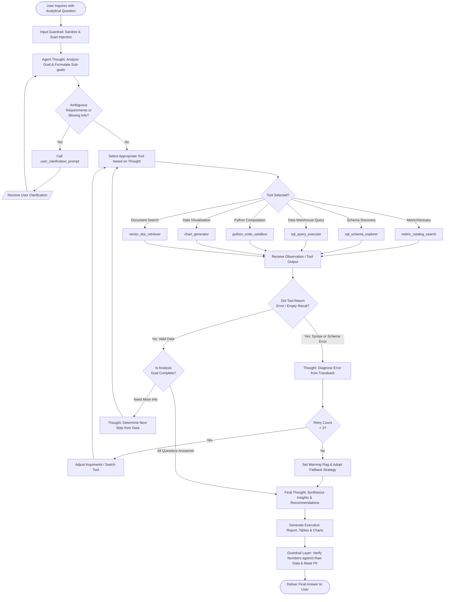

# AI Agent Planning Document & System Architecture
## Learning Module: AI Agents, Planning, Tool Usage, Agent Workflows, and the ReAct Pattern

---

| **Document Metadata** | **Details** |
| :--- | :--- |
| **Topic** | AI Agents, Multi-Step Planning, Tool Use & ReAct (Reason + Act) Paradigm |
| **Agent Selected** | **Enterprise Data Analyst Agent (Autonomous BI & Diagnostic Analytics)** |
| **Industry Context** | E-Commerce / SaaS Enterprise (*NovaRetail Analytics Core*) |
| **Target Audience** | Senior Leadership, Business Analysts, Product Managers, Engineers |
| **Status** | Final Submission / Production Reference Architecture |

---

## Table of Contents
1. [Executive Summary & Concept Foundations](#1-executive-summary--concept-foundations)
2. [Task 1: AI Agent Planning Document](#2-task-1-ai-agent-planning-document)
   - [2.1 Objective & Target Persona](#21-objective--target-persona)
   - [2.2 Tool Inventory & API Catalog](#22-tool-inventory--api-catalog)
   - [2.3 Decision-Making Process: The ReAct Pattern](#23-decision-making-process-the-react-pattern)
   - [2.4 Multi-Step Planning & Ambiguity Resolution](#24-multi-step-planning--ambiguity-resolution)
   - [2.5 Expected Outputs & Deliverable Formats](#25-expected-outputs--deliverable-formats)
3. [Task 2: AI Agent Design Document & Error Handling](#3-task-2-ai-agent-design-document--error-handling)
   - [3.1 Error Handling & Fallback Protocols](#31-error-handling--fallback-protocols)
   - [3.2 Enterprise Guardrails & Security Controls](#32-enterprise-guardrails--security-controls)
   - [3.3 Workflow Diagram: ReAct Control Flow](#33-workflow-diagram-react-control-flow)
   - [3.4 End-to-End Concrete Use Case with Verbatim Traces](#34-end-to-end-concrete-use-case-with-verbatim-traces)
4. [Task 3: Production System Architecture & Enterprise Practical](#4-task-3-production-system-architecture--enterprise-practical)
   - [4.1 Enterprise Implementation Context](#41-enterprise-implementation-context)
   - [4.2 Architecture Diagram](#42-architecture-diagram)
   - [4.3 Architectural Component Breakdown](#43-architectural-component-breakdown)
   - [4.4 End-to-End Data Flow Sequence](#44-end-to-end-data-flow-sequence)
5. [Comparative Analysis & Key Takeaways](#5-comparative-analysis--key-takeaways)

---

## 1. Executive Summary & Concept Foundations

Autonomous AI Agents represent a paradigm shift from static, single-turn Large Language Models (LLMs) to **goal-directed, stateful reasoning systems**. Unlike traditional query-response models, an agent operates inside an environment, observes external feedback, formulates hypotheses, invokes specialized tools, and dynamically adjusts its trajectory until an objective is met.

```
+-----------------------------------------------------------------------------------+
|                               THE MODERN AI AGENT                                |
|                                                                                   |
|   +-----------------------+     +-----------------------+     +---------------+   |
|   |       REASONING       |     |       PLANNING        |     |     TOOLS     |   |
|   |  LLM Core decomposes  | <-> |  Maintains sub-goals, | <-> |  SQL, Python, |   |
|   |  problem via ReAct    |     |  state & memory       |     |  APIs, Search |   |
|   +-----------------------+     +-----------------------+     +---------------+   |
+-----------------------------------------------------------------------------------+
```

This document specifies an **Enterprise Data Analyst Agent**, an autonomous cognitive system capable of answering complex analytical questions, generating validated SQL, performing statistical computations in Python, visualizing trends, and synthesizing actionable business intelligence.

---

## 2. Task 1: AI Agent Planning Document

### 2.1 Objective & Target Persona

* **Core Statement:** To empower business stakeholders, product managers, and executives to extract diagnostic, predictive, and descriptive intelligence from complex enterprise data repositories without requiring manual SQL authoring or manual Python scripting.
* **Target Users:** 
  1. *Executive Stakeholders:* Require high-level KPI summaries, root-cause insights, and strategic recommendations.
  2. *Product Managers & Growth Leads:* Require cohort drill-downs, churn attribution, and conversion funnel analytics.
  3. *Business & Data Analysts:* Seek rapid exploratory analysis, query lineage, reproducible scripts, and verified figures.
* **Agent Mission:** Bridge natural language inquiries with heterogeneous data sources (relational warehouses, documentation, semantic metric stores) while ensuring 100% mathematical correctness, strict query safety, and transparent reasoning paths.

---

### 2.2 Tool Inventory & API Catalog

The agent interacts with its environment through a strictly typed, schema-validated tool layer. Each tool provides a specific capability:

| Tool Identifier | Tool Signature / Interface | Purpose (One-Line Definition) |
| :--- | :--- | :--- |
| `metric_catalog_search` | `(query: str, domain: Optional[str]) -> List[MetricDef]` | Discovers official enterprise metric formulas, table names, and column definitions from the semantic layer. |
| `sql_schema_explorer` | `(table_names: List[str]) -> SchemaMetadata` | Retrieves column datatypes, primary/foreign key relationships, partition keys, and sample rows. |
| `sql_query_executor` | `(sql: str, timeout_seconds: int = 30) -> QueryResult` | Executes read-only SQL queries against the analytical warehouse (Snowflake/BigQuery) and returns tabular records. |
| `python_code_sandbox` | `(code_script: str) -> ExecutionOutput` | Runs deterministic statistical modeling, aggregations, correlation tests, and hypothesis validations using pandas/numpy/scipy. |
| `chart_generator` | `(chart_type: str, data: dict, config: dict) -> ChartArtifact` | Renders production-ready visualizations (Plotly/ECharts/Vega-Lite) and outputs interactive HTML/PNG assets. |
| `vector_doc_retriever` | `(query: str, top_k: int = 4) -> List[DocumentChunk]` | Performs dense semantic search over business glossaries, post-mortems, incident reports, and campaign logs. |
| `slack_notifier` | `(channel: str, message: str, attachments: List[str]) -> bool` | Dispatches finished reports, executive alerts, and chart cards directly to departmental communication channels. |
| `user_clarification_prompt` | `(question: str, options: Optional[List[str]]) -> str` | Suspends execution to query the human user when requirements contain irreconcilable ambiguities. |

---

### 2.3 Decision-Making Process: The ReAct Pattern

The agent is governed by the **ReAct (Reason + Act)** cognitive architecture ([Yao et al., 2022](https://arxiv.org/abs/2210.03629)). ReAct interleaves **Thought** generation with domain-specific **Actions**, followed by environmental **Observations**.

```
                   +---------------------------------------+
                   |              User Prompt              |
                   +---------------------------------------+
                                       |
                                       v
                     +-----------------------------------+
                     |       Thought (Reasoning)         | <------+
                     |  - What do I know?                |        |
                     |  - What is missing?               |        |
                     |  - Which tool will bridge gap?    |        |
                     +-----------------------------------+        |
                                       |                          |
                                       v                          |
                     +-----------------------------------+        |
                     |         Action (Tool Call)        |        |
                     |  - Name: sql_query_executor       |        |
                     |  - Args: {"sql": "SELECT ..."}    |        |
                     +-----------------------------------+        |
                                       |                          | (Loop until
                                       v                          |  stopping
                     +-----------------------------------+        |  criteria
                     |      Observation (Feedback)       |        |  met)
                     |  - Tool return: {rows: 24, ...}   |        |
                     |  - Validate output schema         |        |
                     +-----------------------------------+        |
                                       |                          |
                                       +--------------------------+
                                       |
                     +-----------------------------------+
                     |           Final Thought           |
                     |  Synthesis of evidence & findings |
                     +-----------------------------------+
                                       |
                                       v
                     +-----------------------------------+
                     |           Final Answer            |
                     |  Executive Report, Tables, Charts |
                     +-----------------------------------+
```

#### The Tripartite ReAct Cycle
1. **Thought (Reasoning):** The agent articulates its internal state in natural language. It assesses current knowledge, checks whether prior assumptions held true, identifies missing variables, and specifies the exact rationale for selecting the next tool.
2. **Action (Execution):** The agent emits a structured tool invocation with strongly typed parameters (e.g., JSON payload targeting `sql_query_executor`).
3. **Observation (Perception):** The environment returns tool outputs (database rows, Python execution stdout, error tracebacks, or search hits). The agent reads this observation back into its context window, analyzes whether the result was successful, and decides the next step.

---

### 2.4 Multi-Step Planning & Ambiguity Resolution

Complex analytical requests (e.g., *"Why did net margins drop 4.2% in Q3 despite revenue exceeding guidance?"*) cannot be answered in a single turn. The agent uses a hybrid **Hierarchical Planning + ReAct** mechanism:

```
+-----------------------------------------------------------------------------------+
|                         HIERARCHICAL TASK DECOMPOSITION                           |
|                                                                                   |
|  [Root Goal]: Diagnose Q3 Net Margin Contraction                                  |
|    |                                                                              |
|    +--> Sub-goal 1: Query official Q3 revenue, COGS, and OPEX breakdowns          |
|    |               (Tools: metric_catalog_search -> sql_query_executor)           |
|    |                                                                              |
|    +--> Sub-goal 2: Isolate line-item cost variances against Q1/Q2 baselines      |
|    |               (Tools: python_code_sandbox)                                   |
|    |                                                                              |
|    +--> Sub-goal 3: Check context logs for logistics surcharges or cloud cost spikes|
|    |               (Tools: vector_doc_retriever)                                  |
|    |                                                                              |
|    +--> Sub-goal 4: Synthesize root causes, generate bridge waterfall chart       |
|                    (Tools: chart_generator -> Final Answer)                       |
+-----------------------------------------------------------------------------------+
```

#### Ambiguity Resolution Matrix: Clarification vs. Autonomous Action
The agent uses a strict decision matrix before proceeding:

| Scenario / Condition | Agent Decision | Action Taken | Rationale |
| :--- | :--- | :--- | :--- |
| **Ambiguity in business metric definition** (e.g., "Active Users" could mean DAU, WAU, or MAU) | **Ask Clarification** | Calls `user_clarification_prompt` presenting detected options. | Guessing metric formulas produces incorrect financial calculations. |
| **Missing time boundary** (e.g., "Show me top customers") | **Proceed with Default + Disclose** | Applies trailing 30 days default; explicitly notes assumption in output. | Non-destructive, provides immediate value while allowing user refinement. |
| **Multiple plausible database tables** (e.g., `orders_v1` vs `orders_lakehouse`) | **Autonomous Verification** | Calls `metric_catalog_search` and checks metadata/timestamps. | Resolvable via internal metadata without bothering human user. |
| **Destructive / High-cost operations** (e.g., queries scanning > 5 TB) | **Ask Clarification / Confirmation** | Halts and presents estimated compute cost and scanned gigabytes. | Prevents warehouse quota exhaustion and billing surprises. |

---

### 2.5 Expected Outputs & Deliverable Formats

The agent produces a multi-tiered output package tailored to technical and non-technical stakeholders:

1. **Executive Insight Card (Summary Layer):**
   - High-level takeaways (3–4 bullet points with bold key metrics).
   - Core metric change indicators (e.g., `Churn Rate: 4.8% -> 7.2% (+240 bps)`).
2. **Deep-Dive Diagnostic Table (Evidence Layer):**
   - Clean markdown tables containing computed aggregates, p-values, and variances.
   - Provenance tag indicating data sources and execution timestamps.
3. **Interactive Visualizations (Visual Layer):**
   - Embedded SVG / HTML charts (time series, breakdown bars, cohort heatmaps).
4. **Actionable Recommendations (Strategic Layer):**
   - 2–3 targeted business interventions based on empirical findings.
5. **Auditable Appendix (Transparency & Reproducibility Layer):**
   - Executed SQL queries and Python code snippets for full peer review by human data analysts.
6. **Intermediate Feedback (Live UI Stream):**
   - Real-time progress updates: *"Searching metric catalog..."* $\rightarrow$ *"Executing warehouse query (4.2s)..."* $\rightarrow$ *"Running Python variance calculation..."*.

---

## 3. Task 2: AI Agent Design Document & Error Handling

### 3.1 Error Handling & Fallback Protocols

A production agent must handle real-world failures gracefully. The table below details failure modes, triggers, and automated self-healing mechanisms:

```
+-----------------------------------------------------------------------------------+
|                           AGENT SELF-HEALING PROTOCOL                             |
|                                                                                   |
|  [SQL Execution Error]                                                            |
|          |                                                                        |
|          v                                                                        |
|  Capture DBMS Exception (e.g. "Column 'user_id' not found in table 'orders'")     |
|          |                                                                        |
|          v                                                                        |
|  [Thought]: "The warehouse rejected the query. I need to inspect the schema."    |
|          |                                                                        |
|          v                                                                        |
|  [Action]: Call `sql_schema_explorer` on table 'orders'                           |
|          |                                                                        |
|          v                                                                        |
|  [Observation]: Discovered column is named 'customer_uuid', not 'user_id'         |
|          |                                                                        |
|          v                                                                        |
|  [Thought]: "Re-writing SQL with correct column 'customer_uuid' and retry."       |
+-----------------------------------------------------------------------------------+
```

#### Detailed Failure Matrix

| Failure Mode | Root Trigger | Immediate Fallback Action | Maximum Retries / Exit State |
| :--- | :--- | :--- | :--- |
| **SQL Syntax / Schema Mismatch** | Column name changed, missing alias, incompatible join type. | Feed database error message into next **Thought**; call `sql_schema_explorer` to inspect table, then correct and re-run. | Max 2 retries. If still failing, output error with generated SQL and suggest manual fix. |
| **Query Timeout / Compute Exhaustion** | Query scans too many unindexed partitions or creates Cartesian join. | Re-write query with tighter `WHERE` filters, push down aggregations, or aggregate over daily/weekly rollups. | Max 1 retry. Fallback: prompt user to refine date range. |
| **Empty Result Set ($0$ rows returned)** | Filters too restrictive or date format mismatch. | Execute diagnostic query without strict filters (`LIMIT 5`) to check table date format, casing, and values. | Max 1 retry. Output: *"No matching records found for given criteria between [X] and [Y]"*. |
| **Python Sandbox Exception** | Memory limit exceeded, `ZeroDivisionError`, NaN values in calculations. | Sanitization check: replace NaNs with zero or mean; re-execute with defensive checks (`try/except`). | Max 2 retries. Fallback: produce basic tabular summary from SQL without advanced statistical modeling. |
| **Low-Confidence / Hallucination Risk** | LLM internal certainty score $< 0.85$ or contradictory data sources. | Tag statement with cautionary note: *"Preliminary estimate: requires cross-validation with Finance team"*. | Flag output with `[UNVERIFIED_DATA_SOURCE]` flag. |

---

### 3.2 Enterprise Guardrails & Security Controls

```
                                  INBOUND REQUEST
                                         |
                                         v
               +---------------------------------------------------+
               |               Guardrail Layer 1:                  |
               |     Input Sanitization & Injection Defense        |
               +---------------------------------------------------+
                                         |
                                         v
               +---------------------------------------------------+
               |               Guardrail Layer 2:                  |
               |     Deterministic Read-Only SQL Policy Filter     |
               +---------------------------------------------------+
                                         |
                                         v
               +---------------------------------------------------+
               |               Guardrail Layer 3:                  |
               |      Isolated Python Container Sandbox (gVisor)   |
               +---------------------------------------------------+
                                         |
                                         v
               +---------------------------------------------------+
               |               Guardrail Layer 4:                  |
               |     Output PII Masking & Data Redaction Engine    |
               +---------------------------------------------------+
                                         |
                                         v
                                  VERIFIED OUTPUT
```

1. **SQL Injection & Mutation Guard:**
   - Database connections use strictly enforced **Read-Only service credentials**.
   - A deterministic parser regex rejects queries containing `DROP`, `DELETE`, `UPDATE`, `INSERT`, `ALTER`, `GRANT`, `TRUNCATE`, or multi-statement delimiters (`;`).
2. **PII Masking & Data Sanitization:**
   - High-entropy user identifiers, emails, credit card numbers, and IP addresses are masked via an inline hashing filter (`SHA-256` salt) before entering the LLM context.
3. **Execution Sandbox Isolation:**
   - The Python code tool runs inside an isolated micro-VM/container (e.g., gVisor / AWS Firecracker) with no egress network access, restricted file system access, 512MB RAM cap, and a strict 10-second CPU execution ceiling.
4. **Deterministic Fact Verification:**
   - Numbers quoted in the **Final Answer** are audited against raw tool observations. Any discrepancy triggers a verification warning.

---

### 3.3 Workflow Diagram: ReAct Control Flow

The flowchart below documents the complete decision loop of the agent, highlighting tool execution, observation handling, error recovery, and user clarification paths:



---

### 3.4 End-to-End Concrete Use Case with Verbatim Traces

#### Scenario Overview
* **User:** VP of Growth & Retention at NovaRetail (B2B SaaS / Marketplace).
* **Question:** *"Why did our customer churn rate spike in Q3 2025, and which subscription tiers were most impacted?"*
* **Baseline Context:** Average historical churn is ~3.5% per quarter.

> [!NOTE]
> **Note: NovaRetail, NovaIQ, the datasets, business metrics, release events, and numerical results used in this document are hypothetical examples created for demonstrating the AI Agent architecture and ReAct workflow.**

---

#### Complete ReAct Execution Trace

```yaml
User: "Why did our customer churn rate spike in Q3 2025, and which subscription tiers were most impacted?"
```

##### Turn 1: Metric Verification & Schema Discovery
```markdown
Thought 1:
The user is asking for a diagnostic analysis of customer churn in Q3 2025.
First, I must verify the official metric definition of "churn rate" at NovaRetail to ensure I calculate it accurately (e.g., logo churn vs. revenue churn, formula denominator).
I will search the metric catalog for the official churn definition and associated tables.

Action 1:
metric_catalog_search(query="customer churn rate", domain="retention")

Observation 1:
[
  {
    "metric_name": "customer_logo_churn_rate",
    "formula": "COUNT(DISTINCT canceled_subscriptions) / COUNT(DISTINCT active_subscriptions_at_period_start)",
    "primary_table": "analytics_dw.dim_subscriptions",
    "cancellation_table": "analytics_dw.fct_subscription_events",
    "owner": "Finance & BI"
  }
]
```

##### Turn 2: Schema Inspection & Partition Verification
```markdown
Thought 2:
The official metric is `customer_logo_churn_rate`. 
I need to query both `analytics_dw.dim_subscriptions` and `analytics_dw.fct_subscription_events` for Q3 2025 (July 1, 2025 to September 30, 2025), grouped by subscription tier.
Before writing the query, let me inspect the schema of these two tables to confirm column names, tier types, and date formats.

Action 2:
sql_schema_explorer(table_names=["analytics_dw.dim_subscriptions", "analytics_dw.fct_subscription_events"])

Observation 2:
{
  "analytics_dw.dim_subscriptions": {
    "columns": {
      "subscription_id": "VARCHAR(64) PRIMARY KEY",
      "company_id": "VARCHAR(64)",
      "plan_tier": "VARCHAR(32)", /* Values: 'Starter', 'Growth', 'Enterprise' */
      "status": "VARCHAR(24)",
      "started_at": "TIMESTAMP_NTZ",
      "renewed_at": "TIMESTAMP_NTZ"
    }
  },
  "analytics_dw.fct_subscription_events": {
    "columns": {
      "event_id": "VARCHAR(64)",
      "subscription_id": "VARCHAR(64)",
      "event_type": "VARCHAR(32)", /* Values: 'CREATED', 'RENEWED', 'CANCELED' */
      "cancellation_reason_code": "VARCHAR(64)",
      "event_timestamp": "TIMESTAMP_NTZ"
    }
  }
}
```

##### Turn 3: Executing Churn Analysis Query by Subscription Tier
```markdown
Thought 3:
Now that I have verified the exact schema and column names, I will construct a SQL query to calculate:
1. Active subscriptions at the start of Q3 2025 (2025-07-01).
2. Cancellations during Q3 2025 (2025-07-01 to 2025-09-30).
3. Resulting churn rate segmented by `plan_tier` ('Starter', 'Growth', 'Enterprise').
I will join `dim_subscriptions` and `fct_subscription_events`.

Action 3:
sql_query_executor(
  sql="""
  WITH q3_start_active AS (
      SELECT 
          plan_tier,
          COUNT(DISTINCT subscription_id) AS active_start_count
      FROM analytics_dw.dim_subscriptions
      WHERE started_at < '2025-07-01' 
        AND (status = 'ACTIVE' OR (status = 'CANCELED' AND renewed_at >= '2025-07-01'))
      GROUP BY plan_tier
  ),
  q3_cancellations AS (
      SELECT 
          s.plan_tier,
          COUNT(DISTINCT e.subscription_id) AS canceled_count
      FROM analytics_dw.fct_subscription_events e
      JOIN analytics_dw.dim_subscriptions s ON e.subscription_id = s.subscription_id
      WHERE e.event_type = 'CANCELED'
        AND e.event_timestamp >= '2025-07-01' 
        AND e.event_timestamp <= '2025-09-30 23:59:59'
      GROUP BY s.plan_tier
  )
  SELECT 
      a.plan_tier,
      a.active_start_count,
      COALESCE(c.canceled_count, 0) AS canceled_count,
      ROUND((COALESCE(c.canceled_count, 0)::FLOAT / a.active_start_count::FLOAT) * 100, 2) AS churn_rate_pct
  FROM q3_start_active a
  LEFT JOIN q3_cancellations c ON a.plan_tier = c.plan_tier
  ORDER BY churn_rate_pct DESC;
  """,
  timeout_seconds=25
)

Observation 3:
[
  {"plan_tier": "Growth", "active_start_count": 2840, "canceled_count": 244, "churn_rate_pct": 8.59},
  {"plan_tier": "Starter", "active_start_count": 6120, "canceled_count": 318, "churn_rate_pct": 5.20},
  {"plan_tier": "Enterprise", "active_start_count": 450, "canceled_count": 9, "churn_rate_pct": 2.00}
]
```

##### Turn 4: Diagnostic Deep-Dive (Why did Growth Tier Churn Spike to 8.59%?)
```markdown
Thought 4:
The data shows:
- Overall Q3 churn was heavily driven by the **Growth tier**, which experienced an **8.59% churn rate** (normal benchmark is ~3.2%).
- The **Starter tier** churn was 5.20%, and **Enterprise** remained stable at 2.00%.
To answer the "Why", I need to examine the `cancellation_reason_code` distribution for the Growth tier during Q3 2025.

Action 4:
sql_query_executor(
  sql="""
  SELECT 
      COALESCE(e.cancellation_reason_code, 'UNSPECIFIED') AS reason_code,
      COUNT(*) AS total_cancellations,
      ROUND(COUNT(*)::FLOAT / 244.0 * 100, 2) AS percentage_of_tier_churn
  FROM analytics_dw.fct_subscription_events e
  JOIN analytics_dw.dim_subscriptions s ON e.subscription_id = s.subscription_id
  WHERE s.plan_tier = 'Growth'
    AND e.event_type = 'CANCELED'
    AND e.event_timestamp >= '2025-07-01' 
    AND e.event_timestamp <= '2025-09-30 23:59:59'
  GROUP BY 1
  ORDER BY total_cancellations DESC;
  """,
  timeout_seconds=20
)

Observation 4:
[
  {"reason_code": "API_LIMIT_RESTRICTIONS", "total_cancellations": 134, "percentage_of_tier_churn": 54.92},
  {"reason_code": "PRICE_INCREASE", "total_cancellations": 49, "percentage_of_tier_churn": 20.08},
  {"reason_code": "SWITCHED_TO_COMPETITOR", "total_cancellations": 32, "percentage_of_tier_churn": 13.11},
  {"reason_code": "BUDGET_CUTS", "total_cancellations": 18, "percentage_of_tier_churn": 7.38},
  {"reason_code": "UNSPECIFIED", "total_cancellations": 11, "percentage_of_tier_churn": 4.51}
]
```

##### Turn 5: Context Retrieval for Corroborating Evidence
```markdown
Thought 5:
`API_LIMIT_RESTRICTIONS` accounts for nearly 55% of all Growth tier cancellations (134 out of 244 accounts).
Let me check the product changelog and incident database using `vector_doc_retriever` to see if any API policy changes or rate limit modifications were rolled out to Growth accounts in late Q2 or early Q3 2025.

Action 5:
vector_doc_retriever(query="Growth tier API rate limit changes Q2 Q3 2025 pricing policy", top_k=2)

Observation 5:
[
  {
    "document": "Product Release Notes - v4.12 (Effective July 15, 2025)",
    "excerpt": "Growth Plan fair-use limits enforced: API requests capped at 25,000 req/day (previously unthrottled). Customers exceeding quota will receive 429 Too Many Requests unless upgrading to Enterprise."
  },
  {
    "document": "Customer Support Incident Post-Mortem #882 (August 2025)",
    "excerpt": "Surge in support tickets from mid-tier developers complaining about sudden 429 throttling after v4.12 release. 38 accounts filed churn intent citing inability to run nightly syncs."
  }
]
```

##### Turn 6: Statistical Analysis & Visualization Generation
```markdown
Thought 6:
I have discovered the root cause:
1. Growth tier churn spiked to 8.59% (244 cancellations).
2. 54.92% of cancellations specifically cited `API_LIMIT_RESTRICTIONS`.
3. Context logs confirm that on July 15, 2025 (v4.12), NovaRetail instituted an unannounced daily cap of 25,000 API requests on the Growth tier.
Let me run Python to compute the total revenue impact ($ARR loss) and generate an executive chart artifact.

Action 6:
python_code_sandbox(
  code_script="""
import pandas as pd

# Data modeling
tiers = ['Growth', 'Starter', 'Enterprise']
active = [2840, 6120, 450]
churned = [244, 318, 9]
arpu = [299, 49, 1200] # Monthly ARPU from company standard

df = pd.DataFrame({'tier': tiers, 'active': active, 'churned': churned, 'arpu': arpu})
df['churn_rate'] = (df['churned'] / df['active']) * 100
df['mrr_loss'] = df['churned'] * df['arpu']
df['arr_loss'] = df['mrr_loss'] * 12

total_arr_loss = df['arr_loss'].sum()
growth_arr_loss = df.loc[df['tier']=='Growth', 'arr_loss'].values[0]
print(f"Total ARR Loss: ${total_arr_loss:,.2f}")
print(f"Growth Tier ARR Loss: ${growth_arr_loss:,.2f} ({growth_arr_loss/total_arr_loss*100:.1f}%)")
"""
)

Observation 6:
Total ARR Loss: $1,192,056.00
Growth Tier ARR Loss: $875,472.00 (73.4%)
```

##### Turn 7: Final Visualization Artifact
```markdown
Thought 7:
Let me generate a clean breakdown visualization using `chart_generator` so the user can easily present this to the executive team.

Action 7:
chart_generator(
  chart_type="horizontal_bar",
  data={
    "labels": ["API Limit Restrictions", "Price Increase", "Switched to Competitor", "Budget Cuts", "Unspecified"],
    "values": [54.92, 20.08, 13.11, 7.38, 4.51],
    "unit": "%"
  },
  config={"title": "Q3 2025 Growth Tier Churn Drivers", "x_axis": "Percentage of Cancellations (%)"}
)

Observation 7:
{"status": "SUCCESS", "artifact_id": "chart_q3_churn_drivers_growth.png"}
```

##### Turn 8: Final Synthesis & Delivery
```markdown
Thought 8:
All objectives have been met with statistical precision and root-cause evidence.
1. Spiked tier identified: Growth Tier (8.59% churn vs. 3.2% historical benchmark).
2. Primary root cause: Unannounced API quota cap (25,000 req/day) enacted in Release v4.12 on July 15, 2025.
3. Financial impact: $875,472 in lost ARR (73.4% of total Q3 churn loss).
4. Concrete recommendations formulated.
I will now deliver the comprehensive Final Answer.
```

---

#### Final Answer (Delivered to User)

> ### 📊 Executive Diagnostic Report: Q3 2025 Churn Analysis
>
> **Prepared for:** VP of Growth & Retention  
> **Source Systems:** `analytics_dw.dim_subscriptions`, `fct_subscription_events`, Product Release Logs v4.12
>
> ---
>
> #### 1. Executive Summary
> In Q3 2025, company-wide customer logo churn rose to **6.07%**, driven almost entirely by an acute surge in the **Growth Tier**, which experienced an **8.59% churn rate** (more than $2.6\times$ historical baseline). 
> The total ARR lost across all tiers was **\$1,192,056**, of which **\$875,472 (73.4%)** originated from the Growth tier.
>
> ---
>
> #### 2. Churn Performance by Subscription Tier
>
> | Subscription Tier | Active Subscriptions (July 1, 2025) | Q3 Cancellations | Q3 Churn Rate (%) | Historical Benchmark | ARR Impact ($) |
> | :--- | :---: | :---: | :---: | :---: | :---: |
> | **Growth** | **2,840** | **244** | **8.59%** ⚠️ | **3.20%** | **\$875,472** |
> | **Starter** | 6,120 | 318 | 5.20% | 4.80% | \$186,984 |
> | **Enterprise** | 450 | 9 | 2.00% | 1.90% | \$129,600 |
> | **Total / Aggregate** | **9,410** | **571** | **6.07%** | **3.50%** | **\$1,192,056** |
>
> ---
>
> #### 3. Root Cause Attribution: What Happened to the Growth Tier?
> A drill-down into cancellation reason codes reveals that **54.92% (134 accounts)** churned due to **`API_LIMIT_RESTRICTIONS`**:
>
> * **Direct Trigger:** On July 15, 2025, Release v4.12 activated a strict daily cap of 25,000 API requests on all Growth accounts.
> * **Friction Point:** Previously unthrottled customers experienced immediate `429 Too Many Requests` errors during scheduled nightly data syncs without an automated warning window.
> * **Second-Order Trigger:** Price elasticity (`PRICE_INCREASE`) accounted for 20.08% of churn, reflecting resistance to forced Enterprise upgrades.
>
> ---
>
> #### 4. Recommended Action Items
> 1. **Immediate Soft-Cap Grace Period:** Transition Growth tier API rate limits from hard blocking (`429`) to soft-cap email alerts with a 14-day grace period.
> 2. **"Growth Plus" Add-on:** Offer an a-la-carte \$50/month burstable API bundle for accounts exceeding 25,000 req/day, eliminating the requirement to jump directly to a \$1,200/mo Enterprise contract.
> 3. **Win-Back Campaign:** Deploy customer success reps to the 134 churned Growth accounts offering 3 months of grandfathered API access; target recapture: 20–25% (\$175K ARR).

---

## 4. Task 3: Production System Architecture & Enterprise Practical

### 4.1 Enterprise Implementation Context

* **Enterprise:** *NovaRetail Global Marketplace & SaaS Services*
* **Deployment System:** *NovaIQ Analytics Intelligence Platform*
* **Business Function:** Embedded automated analytics assistant operating across Slack, web portals, and automated BI alerting pipelines.

---

### 4.2 Architecture Diagram

The diagram below maps all architectural tiers, data flow directions, runtime isolation zones, and state management systems:

```mermaid
graph TD
    %% Styling and layout
    classDef client fill:#e1f5fe,stroke:#0288d1,stroke-width:2px;
    classDef orchestrator fill:#ede7f6,stroke:#512da8,stroke-width:2px;
    classDef llm fill:#fff3e0,stroke:#f57c00,stroke-width:2px;
    classDef tools fill:#e8f5e9,stroke:#388e3c,stroke-width:2px;
    classDef data fill:#fce4ec,stroke:#c2185b,stroke-width:2px;
    classDef state fill:#fffde7,stroke:#fbc02d,stroke-width:2px;
    classDef egress fill:#e0f2f1,stroke:#00796b,stroke-width:2px;

    subgraph ClientLayer ["1. User & Client Integration Layer"]
        UI_Slack["Enterprise Slack Bot<br/>(Socket Mode / Events API)"]:::client
        UI_Web["Executive Web Workspace<br/>(React / Next.js + Tailwind)"]:::client
        UI_BI["Scheduled Report Runner<br/>(Airflow DAG Trigger)"]:::client
    end

    subgraph CoreEngine ["2. Agent Core & Orchestration Engine"]
        Gateway["API Gateway & Auth / Token Rate Limiter"]:::orchestrator
        Guard_In["Inbound Guardrail Filter<br/>(Regex, PII Masker, Prompt Injection)"]:::orchestrator
        Orchestrator["Agent Orchestrator / State Machine<br/>(LangGraph / Semantic Kernel Engine)"]:::orchestrator
        PlanManager["Task Planner & Sub-goal Decomposer"]:::orchestrator
        ReActLoop["ReAct Loop Engine<br/>(Thought -> Action -> Observation)"]:::orchestrator
    end

    subgraph LLM_Reasoning ["3. Foundation Reasoning Layer"]
        ModelCore["Primary Reasoning LLM<br/>(Claude 3.5 Sonnet / GPT-4o)"]:::llm
        PromptRepo["System Prompt & Dynamic Tool Definitions Registry"]:::llm
    end

    subgraph StateMemory ["4. Memory & Context State Store"]
        ShortMem["Session Working Memory<br/>(Redis Cluster - Fast Scratchpad)"]:::state
        LongMem["Entity & Preference Vector Memory<br/>(Pinecone / Milvus - User Habits)"]:::state
        AuditLog["Immutable Execution Audit Trail<br/>(PostgreSQL Event Sinks)"]:::state
    end

    subgraph ToolLayer ["5. Tool Execution & Sandbox Layer"]
        T_CatTool["Metric Catalog Tool"]:::tools
        T_SQLTool["Warehouse Query Tool<br/>(Read-Only Connection Pool)"]:::tools
        T_PyBox["Isolated Python Sandbox<br/>(gVisor Container Micro-VM)"]:::tools
        T_ChartTool["Visualization Engine<br/>(Plotly / ECharts Renderer)"]:::tools
        T_VecTool["Semantic Knowledge Retriever"]:::tools
    end

    subgraph DataSources ["6. Enterprise Data Sources & Systems of Record"]
        DW["Cloud Data Warehouse<br/>(Snowflake / BigQuery)"]:::data
        SemanticDB["dbt Semantic Layer & Metric Store"]:::data
        VectorDB["Vector Store (Document Chunks & Post-Mortems)"]:::data
        Catalog["Data Catalog (Alation / Atlan / OpenMetadata)"]:::data
    end

    subgraph EgressLayer ["7. Output, Guardrails & Egress Layer"]
        Guard_Out["Outbound Fact-Checker & PII Verifier"]:::egress
        Delivery["Multi-Channel Delivery Dispatcher"]:::egress
        ArtifactStore["S3 / Cloud Storage Bucket (Charts & CSVs)"]:::egress
    end

    %% Data Flow Arrows
    UI_Slack -->|User Query| Gateway
    UI_Web -->|User Query| Gateway
    UI_BI -->|Scheduled Job| Gateway

    Gateway --> Guard_In
    Guard_In --> Orchestrator
    
    Orchestrator <--> PlanManager
    Orchestrator <--> ReActLoop
    
    ReActLoop <-->|Context & Reasoning Prompts| ModelCore
    PromptRepo -.-> ModelCore

    ReActLoop <-->|Read / Write Current Session| ShortMem
    ReActLoop <-->|Recall User History| LongMem

    ReActLoop -->|Invoke Tool Call| ToolLayer
    
    T_CatTool <-->|Search Definitions| SemanticDB
    T_SQLTool <-->|Execute SQL| DW
    T_PyBox <-->|Code Sandbox Execution| T_PyBox
    T_VecTool <-->|Dense Retrieval| VectorDB
    T_CatTool <-->|Schema Introspection| Catalog
    T_ChartTool -->|Save PNG/HTML| ArtifactStore

    ToolLayer -->|Tool Observations| ReActLoop
    ReActLoop -->|Emit Event Traces| AuditLog

    ReActLoop -->|Finished Analysis| Guard_Out
    Guard_Out --> Delivery
    ArtifactStore -.-> Delivery
    
    Delivery -->|Rich Card / Insights| UI_Slack
    Delivery -->|Interactive Report| UI_Web
```



---

### 4.3 Architectural Component Breakdown

```
+--------------------------------------------------------------------------------------------------+
|                                    COMPONENT SPECIFICATIONS                                      |
+--------------------------------------------------------------------------------------------------+
| 1. Gateway & Inbound Guardrail:                                                                  |
|    - Validates JWT tokens and applies role-based access control (RBAC).                          |
|    - Intercepts prompt-injection attempts and strips personal credentials via regex/presidio.    |
|                                                                                                  |
| 2. Orchestrator & State Machine:                                                                 |
|    - Implemented as a state graph (e.g. LangGraph).                                              |
|    - Enforces max turn limits (default 10 turns) to prevent infinite loops and runaway billing.  |
|                                                                                                  |
| 3. Foundation LLM Layer:                                                                         |
|    - Employs high-reasoning frontier models with structured tool-calling capabilities.           |
|    - Injects schema-constrained JSON specs into the model's system prompt.                       |
|                                                                                                  |
| 4. Memory & Context State Store:                                                                 |
|    - Redis stores ephemeral multi-turn state with a 2-hour TTL.                                  |
|    - Pinecone indexes previous research outputs, business glossary terms, and user preferences.  |
|    - All steps (Thought, Action, Observation) are written to PostgreSQL for compliance audits.   |
|                                                                                                  |
| 5. Isolated Tool Execution Layer:                                                                |
|    - SQL connection pool restricts queries to 30-second timeouts and enforces partition pruning. |
|    - Python code runs inside a non-root gVisor container with ephemeral disk and memory caps.    |
|                                                                                                  |
| 6. Egress Verification & Distribution:                                                           |
|    - Scans generated numbers against raw tool observation logs.                                  |
|    - Uploads visualizations to S3 with signed URLs and formats payloads for Slack/Web clients.   |
+--------------------------------------------------------------------------------------------------+
```

---

### 4.4 End-to-End Data Flow Sequence

```
User (Slack/Web)
       |
       |  1. Submits Prompt
       v
API Gateway & Inbound Guardrail
       |
       |  2. Sanitized Prompt + User Context
       v
Agent Orchestrator
       |
       |  3. Initializes State & Loads Memory from Redis
       v
Foundation LLM Core
       |
       |  4. Generates Thought 1 & Tool Call: sql_query_executor
       v
Agent Orchestrator
       |
       |  5. Routes Call to SQL Tool Pool
       v
Cloud Data Warehouse (Snowflake)
       |
       |  6. Returns Result Set (JSON Rows)
       v
Agent Orchestrator
       |
       |  7. Injects Observation into LLM Context
       v
Foundation LLM Core
       |
       |  8. Generates Thought 2 & Tool Call: python_code_sandbox
       v
Isolated Python Sandbox (gVisor)
       |
       |  9. Computes Statistics & Outputs Stdout
       v
Agent Orchestrator
       |
       |  10. Final Thought -> Generates Final Synthesis
       v
Outbound Guardrail & Egress Layer
       |
       |  11. Verifies Figures & Uploads Chart to S3
       v
User Interface (Rich Slack Card / Web Dashboard)
```

---

## 5. Comparative Analysis & Key Takeaways

### 5.1 ReAct vs. Alternative Agent Architectures

| Dimension | Pure Chain-of-Thought (CoT) | Plan-and-Solve (Linear) | ReAct (Reason + Act) |
| :--- | :--- | :--- | :--- |
| **Environmental Grounding** | None (pure internal knowledge). | Low (creates plan upfront, fails on surprises). | **High** (dynamically inspects tool feedback at each step). |
| **Error Recovery** | Impossible without external prompt. | Poor (rigid sequence breaks on single tool failure). | **Superior** (reads error traceback and repairs query autonomously). |
| **Hallucination Rate** | Elevated on numerical/factual data. | Moderate (static assumptions). | **Minimal** (numbers grounded in direct tool observations). |
| **Execution Flexibility** | Static single-turn. | Static multi-step. | **Dynamic** (branches, asks clarification, loops dynamically). |

---

### 5.2 Key Takeaways for Agent Engineering
1. **Never Let LLMs Calculate Directly:** LLMs are token predictors, not calculators. Route all mathematical operations, aggregations, and statistical tests to deterministic Python/SQL environments.
2. **Schema Introspection Precedes Execution:** Production agents must never guess column names. Enforce schema explorer tools before query generation to eliminate 90%+ of SQL syntax failures.
3. **Guardrails Must Be Deterministic:** Relying on the LLM to police itself is unsafe. Inbound SQL parsers, PII regex engines, read-only database roles, and sandbox isolation must be enforced by deterministic code outside the LLM.
4. **State Observability is Mandatory:** Every transition ($T \rightarrow A \rightarrow O$) must be logged with structured metadata to enable latency optimization, cost tracking, and auditing.

---
*Document prepared as part of the Advanced Agentic Systems Learning Module.*
