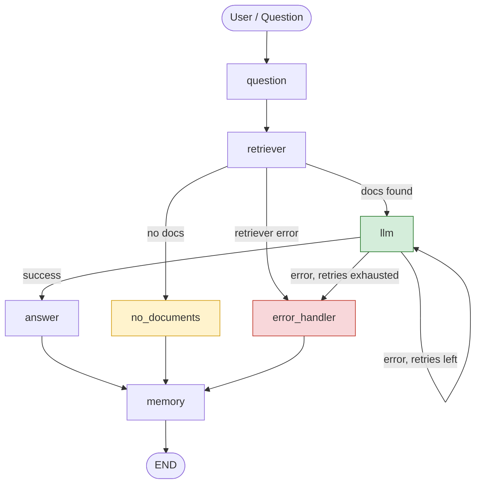

# LangGraph Workflow Analysis Report

## 1. Original Design

```
User → Question → Retriever → LLM → Answer → Memory
```

A linear pipeline: the user's question is passed to a retriever, the
retrieved context and question go to an LLM, the LLM's output becomes the
answer, and the turn is saved to memory.

## 2. Failure Scenario Identified

**Scenario: The retriever returns no relevant documents, or the LLM call
fails transiently (timeout / rate limit / API error).**

In the original linear design, both failures are fatal:
- If `Retriever` returns an empty result, `LLM` still runs with no context,
  producing a hallucinated or low-quality answer with no signal that
  anything went wrong.
- If `LLM` throws an exception (network blip, rate limit, malformed
  response), the graph crashes and the user gets no response at all —
  there is no path back to a working state.

This is a realistic and common failure mode: retrieval "misses" and
transient LLM API errors are two of the most frequent issues in
production RAG systems.

## 3. Recovery Strategy

The workflow was extended with two mechanisms:

### a) Conditional routing after retrieval
A conditional edge inspects the retriever's output:
- **Documents found → `LLM` node** (happy path)
- **No documents found → `no_documents` node**, which returns an
  honest fallback message asking the user to rephrase, instead of letting
  the LLM guess with empty context
- **Retriever raised an error → `error_handler` node**

### b) Conditional routing + bounded loop after the LLM call
A conditional edge inspects whether the LLM call raised an error:
- **Success → `answer` node** (happy path)
- **Error, and retries remaining (≤ `MAX_RETRIES`) → loop back into the
  `llm` node** and try again — this is the "loop" in the graph, guarded by
  a `retry_count` field in state so it cannot run forever
- **Error, retries exhausted → `error_handler` node**, which returns a
  safe, user-facing fallback message instead of crashing

Both failure branches converge on `memory`, so even a failed turn is
still recorded (with its error state), and the graph always terminates
cleanly at `END`.

## 4. Updated LangGraph Diagram



## 5. Error Handling Notes

| Failure mode | Detected at | Detection method | Recovery |
|---|---|---|---|
| Retriever returns empty results | `retriever` → conditional edge | `route_after_retrieval`: checks `state["documents"]` is empty | Routes to `no_documents`; returns a clarifying fallback message instead of an empty-context answer |
| Retriever throws an exception (index/network error) | `retriever_node` | try/except sets `state["error"]` | Routes to `error_handler`; user gets a safe fallback, error is preserved in state for logging |
| LLM call fails transiently (timeout, rate limit) | `llm_node` | try/except sets `state["error"]` and increments `state["retry_count"]` | `route_after_llm` sends the graph back into `llm` (loop) up to `MAX_RETRIES` times |
| LLM keeps failing past `MAX_RETRIES` | `route_after_llm` | `retry_count > MAX_RETRIES` | Routes to `error_handler`; returns fallback message, avoids infinite retry loop |
| Any handled failure | `error_handler` / `no_documents` | n/a | Both paths still flow into `memory` and `END`, so the graph never crashes and every turn (success or failure) is recorded |

**Design notes:**
- The retry loop is *bounded* (`MAX_RETRIES`) specifically to avoid an
  infinite loop — an unconditional "retry on error" edge without a
  counter in state is a common LangGraph bug.
- Centralizing error handling in one `error_handler` node (rather than
  inline fallback text in every node) keeps logging/alerting logic in one
  place and makes it easy to extend later (e.g. send to Sentry, Slack).
- All failure branches still write to `memory`, so a conversation's
  history reflects what actually happened, including failures — useful
  for debugging and for multi-turn context.

## 6. Deliverables Checklist
- [x] Workflow Analysis Report (this document, sections 1–3)
- [x] Updated LangGraph Diagram (section 4)
- [x] Error Handling Notes (section 5)
- [x] Reference implementation: `rag_workflow.py`
