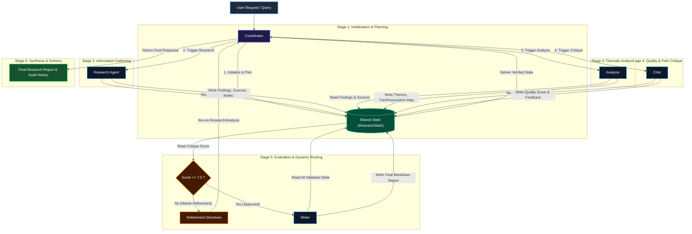
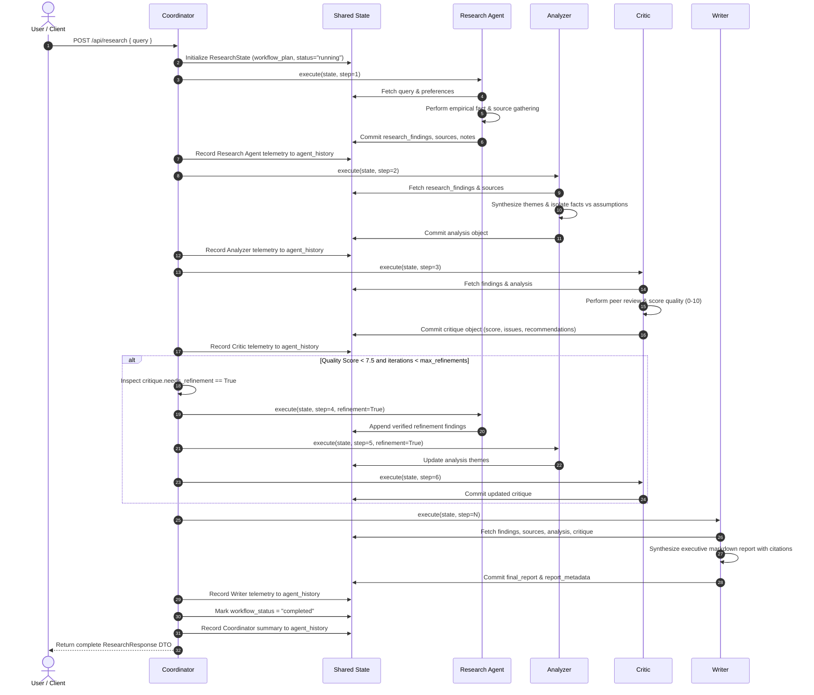

# Multi-Agent Workflow Specification

This document details the multi-agent execution pipeline, agent communication topologies, and decision branches implemented in the **Multi-Agent Research Assistant**.

---

## 1. Multi-Agent Workflow Diagram

---

## 2. Sequence Diagram: Agent-to-Agent Communication Flow

---

## 3. Communication Flow Mechanics

### Indirect Communication via Central Shared State
Unlike peer-to-peer point-to-point architectures where agents pass arbitrary payload arguments directly, our system adheres to **Blackboard / Shared State Pattern**:
1. **Zero Point-to-Point Couplings:** The `Analyzer` does not call `Research Agent`. It only inspects the `research_findings` array committed to `ResearchState`.
2. **Schema Invariant:** Every stage reads typed sub-structures defined via Pydantic models (`Finding`, `SourceReference`, `AnalysisTheme`, `CriticEvaluation`).
3. **Auditability:** Because every mutation passes through `ResearchState`, the complete trajectory is preserved in `state.agent_history`.

### The Refinement Feedback Loop
1. When the `Critic` executes, it evaluates the empirical rigor of the findings and the coherence of the analysis.
2. If gaps are identified (or if quality falls below threshold `7.5`), `state.critique.needs_refinement` is set to `True`.
3. The `Coordinator` inspects this flag. If the refinement budget (`max_refinements = 1`) is not exceeded, the Coordinator routes control back to the target stage with explicit instructions from `state.critique.recommendations`.
4. Once refined findings are cataloged and re-analyzed, the Critic re-evaluates the output before report generation proceeds. This prevents low-quality hallucinations or incomplete studies from reaching the final deliverable.
