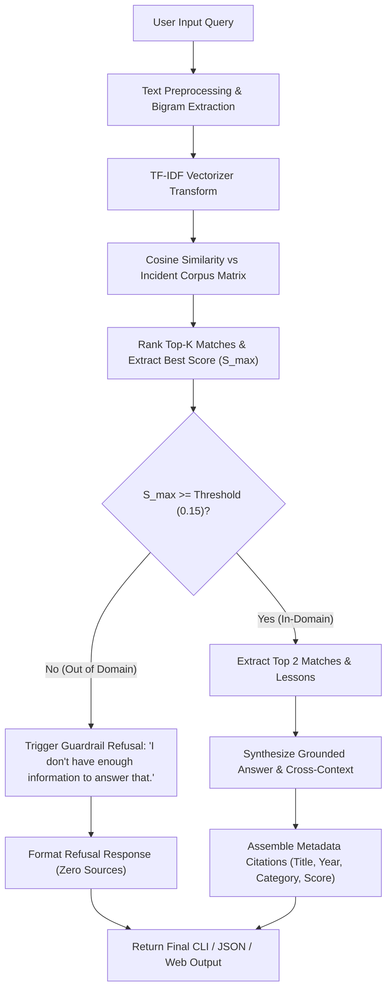

# System Architecture: AI Incident Finder

This document details the architectural design, algorithmic components, decision rationale, and data flow of the **AI Incident Finder** offline Retrieval-Augmented Generation (RAG) system.

---

## 1. System Data Flow

The following Mermaid flowchart illustrates the end-to-end processing pipeline from user input query to final cited response:

---

## 2. Core Architectural Components

### A. Incident Knowledge Base (`data/incidents.json`)
The system maintains a lightweight JSON datastore containing 8 high-impact real-world AI ethics and safety incidents across four primary risk taxonomies:
- **Bias:** Amazon Resume Filter, Robert Williams Detroit Arrest, Optum Healthcare Disparity.
- **Privacy:** Samsung Semiconductor Source Code Leak, Clearview AI Biometrics Scraping.
- **Hallucination:** Mata v. Avianca Federal Case Citations, Google Bard James Webb Telescope Claim.
- **Misinformation:** Pentagon Explosion Synthetic Hoax Image.

Each record includes structured attributes:
- `title`: Canonical event name.
- `year`: Incident year.
- `category`: Ethics classification (`bias`, `privacy`, `misinformation`, `hallucination`).
- `summary`: ~100-word factual account of the failure mechanism and consequences.
- `lesson`: Key takeaway for engineers and policy makers.

### B. Representation & Retrieval Engine
Rather than loading multi-gigabyte neural transformer models or establishing external API connections, the system uses scikit-learn's `TfidfVectorizer`:
- **N-gram Range:** Unigrams and Bigrams `(1, 2)`. Bigrams preserve critical compound terminology such as *"facial recognition"*, *"resume screening"*, and *"legal citations"*.
- **Sublinear Term Frequency Scaling:** Replaces raw term count $tf$ with $1 + \log(tf)$ to dampen the influence of repetitively occurring terms.
- **Stopwords:** Filtered using standard English stopword lexicon.
- **Similarity Metric:** Cosine similarity computed between query vector $\vec{q}$ and corpus matrix $M$:
  $$\text{Cosine Similarity}(\vec{q}, \vec{d}_i) = \frac{\vec{q} \cdot \vec{d}_i}{\|\vec{q}\|_2 \|\vec{d}_i\|_2}$$

### C. Guardrail & Confidence Calibrator
A primary failure mode of standard RAG systems is attempting to answer out-of-domain queries by retrieving the closest unrelated text. 

To prevent hallucinations:
1. The top retrieval score $S_{\text{max}} = \max_i \text{sim}(\vec{q}, \vec{d}_i)$ is compared against empirical threshold $\tau = 0.15$.
2. If $S_{\text{max}} < 0.15$, the query is classified as out-of-domain or ungrounded.
3. The system halts answer generation and responds with:  
   *"I don't have enough information to answer that."*

### D. Grounded Answer Assembler & Citation Engine
For valid queries:
1. The top document ($\text{Match}_1$) provides the primary explanation and key engineering lesson.
2. If the secondary document ($\text{Match}_2$) achieves $\text{sim} \ge \tau$, it is appended as related secondary context to enrich understanding across related categories.
3. Every claim is attributed to exact primary sources with publication year, classification tag, and match confidence score.

---

## 3. Key Design Decisions & Trade-Offs

| Decision | Rationale | Trade-Off |
| :--- | :--- | :--- |
| **TF-IDF vs. Dense Neural Embeddings** | Zero runtime cold-start, instant in-memory vectorization, zero API costs, zero network failure modes, minimal disk footprint. | Relies on vocabulary overlap; does not handle complex paraphrasing where synonyms share no root tokens. |
| **Deterministic Synthesis vs. Generative LLM** | 100% immune to hallucination. Answers are directly verifiable against curated ground truth. | Less conversational fluidity compared to an autoregressive language model. |
| **Fixed Threshold ($\tau = 0.15$)** | Calibrated via empirical testing across relevant vs. adversarial irrelevant queries. Separates noise ($\le 0.0669$) from signal ($\ge 0.1565$). | Requires recalibration if the dataset expands significantly or corpus vocabulary distribution shifts. |
| **Monolithic CLI + Thin Web Layer** | Modular separation: `IncidentRAG` core can be consumed by CLI (`app.py`), pytest (`test_app.py`), or Streamlit (`streamlit_app.py`) in < 25 lines. | Streamlit is optional and strictly decoupled from the core retrieval logic. |
